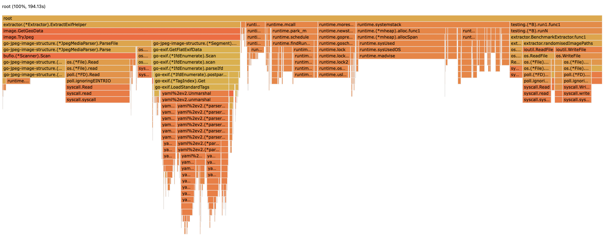
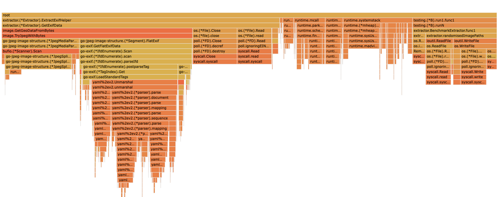

## GEO EXIF

A utility to extract geo information in a directory. Currently, Only JPEG is supported.

Run as: 

```
go run pkg/cmd/main.go -help
```

To output in CSV format 

```
go run pkg/cmd/main.go -dir ./images -output-file test.csv
```


To output in HTML format 

```
go run pkg/cmd/main.go -dir ./images -output-file test.html --html
```


### BenchMarks

The benchmark presented here is between SimpleExtractor and ExtractorWithBufferPool of pkg/extractor package tested on a 16GB 8-core Apple M1 chip.

```
goos: darwin
goarch: arm64
pkg: geoexif/pkg/extractor
                             │ without-pool.txt │            with-pool.txt            │
                             │      sec/op      │    sec/op     vs base               │
Extractor/file_count_100-8         46.46m ± 26%   43.32m ± 15%        ~ (p=0.180 n=6)
Extractor/file_count_500-8         266.0m ±  8%   198.3m ± 15%  -25.43% (p=0.002 n=6)
Extractor/file_count_1000-8        515.9m ± 16%   403.6m ±  5%  -21.77% (p=0.002 n=6)
Extractor/file_count_10000-8        6.078 ± 19%    5.268 ±  9%  -13.33% (p=0.002 n=6)
geomean                            443.7m         367.6m        -17.14%

                             │ without-pool.txt │            with-pool.txt            │
                             │       B/op       │     B/op      vs base               │
Extractor/file_count_100-8         212.3Mi ± 0%   282.3Mi ± 7%  +32.94% (p=0.002 n=6)
Extractor/file_count_500-8         1.081Gi ± 0%   1.253Gi ± 3%  +16.00% (p=0.002 n=6)
Extractor/file_count_1000-8        2.172Gi ± 0%   2.444Gi ± 3%  +12.54% (p=0.002 n=6)
Extractor/file_count_10000-8       21.82Gi ± 0%   23.98Gi ± 0%   +9.92% (p=0.002 n=6)
geomean                            1.805Gi        2.121Gi       +17.52%

                             │ without-pool.txt │           with-pool.txt            │
                             │    allocs/op     │  allocs/op   vs base               │
Extractor/file_count_100-8          699.0k ± 0%   618.4k ± 7%  -11.53% (p=0.002 n=6)
Extractor/file_count_500-8          3.642M ± 0%   3.443M ± 2%   -5.45% (p=0.002 n=6)
Extractor/file_count_1000-8         7.320M ± 0%   7.011M ± 1%   -4.22% (p=0.002 n=6)
Extractor/file_count_10000-8        73.53M ± 0%   71.41M ± 0%   -2.88% (p=0.002 n=6)
geomean                             6.084M        5.714M        -6.08%
```

### Flame Graphs

SimpleExtractor



ExtractorWithBufferPool



